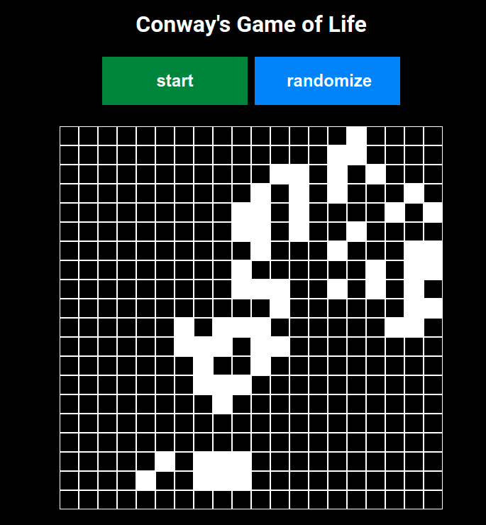

# Conway's Game of Life

https://en.wikipedia.org/wiki/Conway%27s_Game_of_Life

- You can add or delete alive cells by leftclicking the mouse
- You can Start the simulation by clicking 'start'
- You can generate random starting state for the visualisation by clicking 'randomize'

# Prerequisites

- node
- npm
- git

# App setup

```bash
#clone the repository
git clone <repository>
#change directory into the project path
cd <repository name>
#install dependecies
npm install

```

## Now you can run the app:

```bash
npm start
```

# Globals.js (edit to modify the game)

```
export const ROWS = <number of rows>;
export const COLS = <number of collumns>;
export const INTERVAL = <tickrate in milliseconds>;
export const ALIVE_PERCENT = <number from 0 to 1>; // 50% === 0.5
```

## Screenshot of the app


